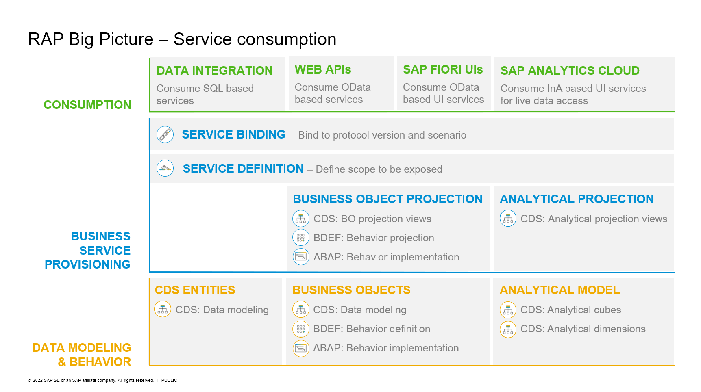

# AD164 - Introduction of ABAP Cloud to classic ABAP developers

## Description

This repository contains the material for the SAP TechEd 2023 session called AD164 - Introduction of ABAP Cloud to classic ABAP developers.  

## Overview

This course uses the well known travel booking reference app for classic ABAPers. During the course of this session, we will go through two demos and then followed by a hands-on providing an experience on how to handcode the same in ABAP Cloud with our well known ABAP RESTful Application Programming Model ( RAP ). We will have short overview of the RAP artefacts that gets generated and will preview the app via the Fiori elements preview to check the developed OData UI service. 

Additionally, we have a short optional HandsOn exercise to enrich our existing fiori preview and hence our app utilizing ratings from the underlying Agency data model.

We also have demos showcasing - 
1. Use ABAP Repository Object Generator in ADT to quickly generate RAP artefacts
2. Behaviour Implementations - Managed, Managed with Additional Save and Unmanaged
3. Ways to consume existing WRICEF Objects in new ABAP Cloud

### Business Scenario 

 
Click to expand!

 
 **Create a custom BO for a specific business context**

- An existing customer/partner wants to create a new business application for Travel Booking Approvals. Users of this approval App can either Approve or Reject a travel booking that is posted in the system. This will be realized with RESTful ABAP Programming Model(RAP). 

 - You’ll build the application step-by-step, starting with creating the database table to hold all the relevant travel booking, you will then create the RAP BOs ( interface and projections ) with the relevant nodes data modelled with CDS entities to read and expose relevant data to the oData UI service ( please note this is a similar data model that was also used in the second demo involving ALV with IDA ), we will enrich the generated data model with relevant UI annotations that help us define how the data needs to be presented on the UI by defining these in CDS Medata Data Extensions ( MDE ),  you will then enable transactional capabilities to the RAP BO using Behavior Definitions ( BDEFs ) and their Behavior implementations ( BIL ) which also includes two user defined custom actions APPROVE and REJECT, you will then expose relevant RAP artefacts using a Service Definition and bind it to an oDATA V2 / V4 UI protocol using the Service Binding.

We then preview the generated OData UI service using the Fiori elements preview to see how the created UI service is rendered using the UI annotations with which we have enriched our data model via the MDE.

Your application will look like this:
 
 
- Now, the customer/partner wishes to enhance the existing travel booking approval  application with ratings from the Agency.  When a travel booking is being approved, it is good to see the agency review rating in the list. Using the developer extensibility and underlying data models in SAP S/4HANA OnPremise ABAP Environment, custom code can be added to existing business logic of the travel approval BO to fulfil this requirement.

 Your application will finally look like this:

 
 

### Architecture Overview

 
Click to expand!

The figure below illustrates the high-level architecture components of the ABAP RESTful Application Programming Model (RAP). It shows the main technologies and artefacts needed to build an SAP Fiori app or a Web API with RAP from a design time perspective.
 
 
 
 You can find a more information on RAP concepts on the [Getting Started with the ABAP RESTful Application Programming Model (RAP) Blog](https://blogs.sap.com/2019/10/25/getting-started-with-the-abap-restful-programming-model/).

 

 

## Requirements

To carry out the exercises of this repository, you need to
1. Install the ABAP Development Tools (ADT) for ABAP development
2. Have a browser ready, preferably Google Chrome, to see Fiori Elements preview

The users for the development environment will be provided to you by the hosts during the session.

Go to Getting Started - Preparation to find out the installation details, URLs, then start with the first exercise.

## Exercises

[^Top of page](#)

 
Click to expand!

- [Getting Started](exercises/ex0/)
  
   Demos - Travel Booking Approval App using ALVs
    - Demo 1 - Travel booking approval app using Classic ABAP ALV
    - Demo 2 - Travel booking approval app using ABAP ALV with IDA

- [Exercise 1 - Create Your Own Read Only UI Service](exercises/ex1/README.md#exercise-1---create-your-own-read-only-ui-service)
    - [Exercise 1.1 - Create an ABAP Package](exercises/ex1/README.md#exercise-11-create-an-abap-package)
    - [Exercise 1.2 - Create a Database Table](exercises/ex1/README.md#exercise-12-create-a-database-table)
    - [Exercise 1.3 - Create a CDS data model](exercises/ex1/README.md#exercise-13-create-a-cds-data-model)
    - [Exercise 1.4 - Create a CDS projection views ](exercises/ex1/README.md#exercise-14-create-a-cds-projection-views)
    - [Exercise 1.5 - Create Your Service Definition](exercises/ex1/README.md#exercise-15-create-your-service-definition)
    - [Exercise 1.6 - Create Your Service Binding and Test using Fiori Elements Preview](exercises/ex1/README.md#exercise-16-create-your-service-binding-and-test-using-fiori-elements-preview)
    - [Exercise 1.7 - Generate Test data and Test using Fiori Elements Preview](exercises/ex1/README.md#exercise-17-generate-test-data-and-test-using-fiori-elements-preview)

- [Exercise 2 - Enhance the Read Only UI service with Transactional Capabilities and showcase developer extensibility and Fiori feature](exercises/ex2#exercise-2---enhance-the-read-only-ui-service-with-transactional-capabilities-and-showcase-developer-extensibility-and-fiori-feature)
    - [Exercise 2.1 - Create a Behavior Defintion for CDS data model](exercises/ex2#exercise-21-create-behavior-defintion-for-cds-data-model)
    - [Exercise 2.2 - Create a Projection of the Behavior Defintion for projection views](exercises/ex2#exercise-22-create-behavior-defintion-for-projection-views)
    - [Exercise 2.3 - Enable the UI service with custom actions](exercises/ex2#exercise-23-enable-read-only-ui-service-with-custom-actions)
    - [Exercise 2.4 - Test using Fiori Elements Preview](exercises/ex2#exercise-24-test-using-fiori-elements-preview)
    - [Exercise 2.5 - Demo Only - Add additional fields/ associations/compositions to existing data models via Developer Extensibility](exercises/ex2#exercise-25-demo-only---how-to-add-additional-fields-associationscompositions-to-existing-data-models-via-developer-extensibility)
    - [Exercise 2.6 - Consume the data from extended view and Test using Fiori Elements Preview](exercises/ex2#exercise-26-consume-the-data-from-extended-view-and-test-using-fiori-elements-preview)
      

## Addtional Demos

[^Top of page](#)

 
Click to expand!

 
   Demos on Usage of ABAP Repository Object Generator, RAP Behavior implementation types, Consumption of WRICEF objects in ABAP Cloud
   - Demo 1 - Generate RAP artefacts using ABAP Repository Object Generator in ADT
   - Demo 2 - Behaviour Implementations - Managed, Managed with Additional Save and Unmanaged
   - Demo 3 - Consume existing WRICEF Objects in new ABAP Cloud 
    

     

## How to obtain support
[^Top of page](#)

Support for the content in this repository is available during the actual time of the online session for which this content has been designed. Otherwise, you may request support via the [Issues](../../../../issues) tab.

## Further Information
[^Top of page](#)

You can find further information on the different topics here: 
- [SAP S/4HANA Cloud ABAP Environment](https://www.sap.com/about/events/teched-news-guide/composable-enterprise-solutions.html)
- [New ABAP Platform Extensibility Options for SAP S/4HANA](https://blogs.sap.com/2021/11/19/new-abap-platform-extensibility-options-in-2021/)
- [Getting Started with the ABAP RESTful Application Programming Model (RAP)](https://blogs.sap.com/2019/10/25/getting-started-with-the-abap-restful-programming-model/)
- [ABAP Extensibility Topic Page @SAP Community](https://community.sap.com/topics/abap-extensibility)
- [Fiori Feature Showcase App Guide](https://github.com/SAP-samples/abap-platform-fiori-feature-showcase/wiki/Feature-Showcase-App-Guide)

## License
Copyright (c) 2023 SAP SE or an SAP affiliate company. All rights reserved. This project is licensed under the Apache Software License, version 2.0 except as noted otherwise in the [LICENSE](LICENSES/Apache-2.0.txt) file.
