# Exercise 1 - Create Your Own Read Only UI Service

After the **[Getting Started](../ex0/README.md)**, you will create your own RAP business object (BO) in the present exercise.

This RAP BO represents an Travel Booking Approval application , where you can Approve OR Reject travel booking as a booking approver.

## Exercise 1.0 Add system connection to ADT
[^Top of page](#)

 <details>
  <summary>Click to expand!</summary>
    
1. Open ABAP Developer Tools
2. Add ABAP perspective to the IDE - Click on **Search** icon on the toolbar and type **ABAP** and select the entry **ABAP** under the perspectives
   
   
3. Select the ABAP Perspective to have the set of views related to ABAP development configured in the IDE
4. Click on the option **Create an ABAP Project** ( if this is the first system that is being connected in the ADT workspace ). If connections to other systems already exist in the project explorer, right-click in the **Project Explorer** view and select option **New** -> **ABAP Project** to get the **New ABAP Project** wizard to add the project ( system ) to the workspace.
   
   
5. In the **New ABAP Project** wizard, click on **New system connection** hyperlink
   
   
6. Enter the following details in the **New ABAP Project Wizard** and click **Next**
   
   - **System ID** : **HE4**
   - **Connection Type** : Choose **Custom Application Server** from the drop down menu
   - **Application Server** : **s4hana1.tdc.sap.com**
   - **Instance Number** : **00**
   - Uncheck option "Activate Secure Network Communication (SNC) as show in the screenshot below

   
   
7. In following step, enter the details given below and click **Next**
   
   - **Client** : **400*
   - Enter the user credendtials as supplied by the speaker during the session

    
   
8. In following step, enter the details given below and click **Finish**
   - **Project Name** : **HE4_400_AD164_EN**
   

9. A project with the name **HE4_400_AD164_EN** will now be available under the Project Explorer representing an active connection to the backend system
     
   
</details>   

## Exercise 1.1 Create an ABAP Package
[^Top of page](#)

 <details>
  <summary>Click to expand!</summary>
  
0.[OPTIONAL]: Add **ZAD164** to **Favorite Packages** via right-click on the favourite packages and select **Add Package..** from the context menu.
   
    In the pop up for **Select an ABAP Package**, type ZAD164 as the search term and choose the entry **ZAD164** under the **Matching items:** window and click on **OK**.
   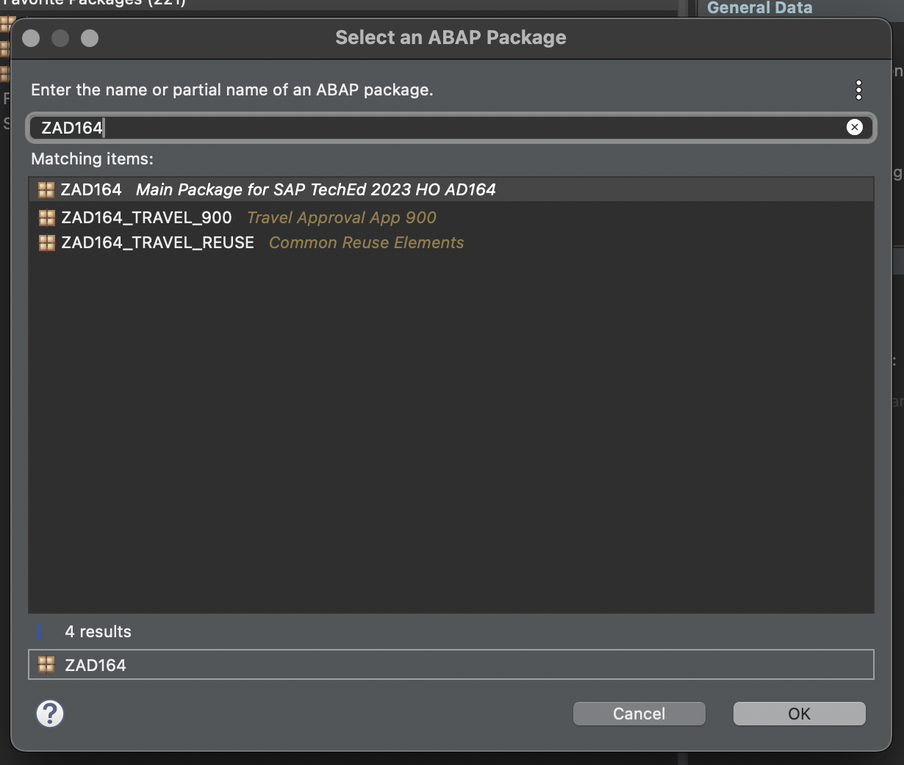 
   
2.	Right-click on the package **ZD164** ( if the Optional step 0 was performed ), Else Right-click on the System **HE4_400_AD164_EN** listed in the project explorer and select **New > ABAP Package** from the context menu. 
   
  	
3.	Maintain the information provided below and click **Next >**.  
    - Name: **`ZAD164_TRAVEL_XXX`**
    - Description: `Travel Approval App XXX`
    - Check ** `Add to favorite packages` **
    - Ensure that **Superpackage:** has value **ZAD164** 
    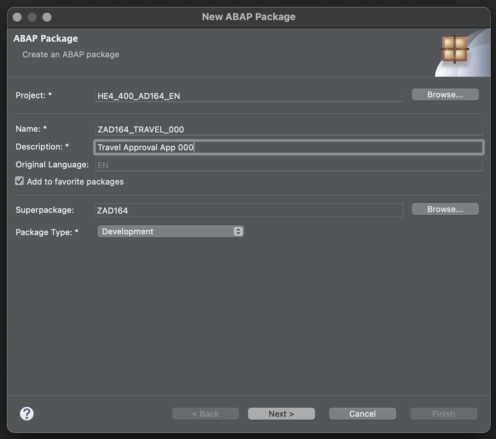 
    - Select TR `HE4K917646` from option **Choose from requests in which i am involved** OR choose option **Enter a request number** and  provide a transport request number `HE4K917646`
     
     

 Note to Speakers : Tasks for the participants have to be created in the TR HE4K917646 to ensure that option "Choose from requests in which i am involved" is usable by participants.

4.	Click **Finish** to finish creation of the package and add the package to favorite pacakges list.
   You should now see your new package in your Project Explorer.
      
  
</details>


## Exercise 1.2 Create a Database Table
[^Top of page](#)

<details>
  <summary>Click to expand!</summary>
 
Create a database table  to store the _TravelBooking_ data.   
A TravelBooking entity defines general data, such as the agency, customer, begin and end date of the travel, total price with the currency, description of the travel and overall status denoting the approval status 

   1. Right-click on your ABAP package **`ZAD164_TRAVEL_###`** and select **New** > **Other ABAP Repository Object** from the context menu.
    
    
   2. Search for **Database Table**, select it, and click **Next >**.
    

   3. Maintain the required information (`###` is your group ID) and click **Next >**.
      - Name: **`ZAD164TRAVEL_###`**  
      - Description: _**`Persistence for Travel Booking ###`**_                  
    

   4. Select your transport request, and click **Finish** to create the database table.
    

   5. Replace the default code with the code snippet provided below and replace all occurences of the placeholder **`###`** with your group ID using the **Replace All** function (**Ctrl+F**).    
 
      **Hint**: Hover over the code snippet and choose the _Copy raw contents_ icon  appearing in the upper-right corner to copy it. Ensure to replace all occurences of XXX with your user group number
         
  <pre lang="ABAP">
  @EndUserText.label : 'Persistence for Travel Booking XXX'
  @AbapCatalog.enhancement.category : #NOT_EXTENSIBLE
  @AbapCatalog.tableCategory : #TRANSPARENT
  @AbapCatalog.deliveryClass : #A
  @AbapCatalog.dataMaintenance : #RESTRICTED
  define table zad164travel_XXX {
    key client            : abap.clnt not null;
    key travel_uuid       : sysuuid_x16 not null;
    travel_id             : zad164_travel_id not null;
    agency_id             : zad164_agency_id not null;
    customer_id           : zad164_customer_id not null;
    begin_date            : zad164_begin_date;
    end_date              : zad164_end_date;
    @Semantics.amount.currencyCode : 'zad164travel_000.currency_code'
    booking_fee           : zad164_booking_fee;
    @Semantics.amount.currencyCode : 'zad164travel_000.currency_code'
    total_price           : zad164_total_price;
    currency_code         : zad164_currency_code;
    description           : zad164_description;
    overall_status        : zad164_overall_status;
    local_created_by      : abp_creation_user;
    local_created_at      : abp_creation_tstmpl;
    local_last_changed_by : abp_locinst_lastchange_user;
    local_last_changed_at : abp_locinst_lastchange_tstmpl;
    last_changed_at       : abp_lastchange_tstmpl;
  
  }
  </pre>
       
   6. Save  and activate  the changes.
</details>

## Exercise 1.3 Create a CDS data model
[^Top of page](#)

 <details>
  <summary>Click to expand!</summary>
  
  1.	Right-click on the data base table  **`ZAD164TRAVEL_XXX`** and select **New Data Definition** from the context menu.
     

  2. Maintain the information provided below and click **Next**.

   - Name: **`ZAD164_R_TRAVEL_XXX`**
   - Description: _**`Data model for Travel App XXX`**_ .   
     
    
  3.Select your transport request and click **Next**.
     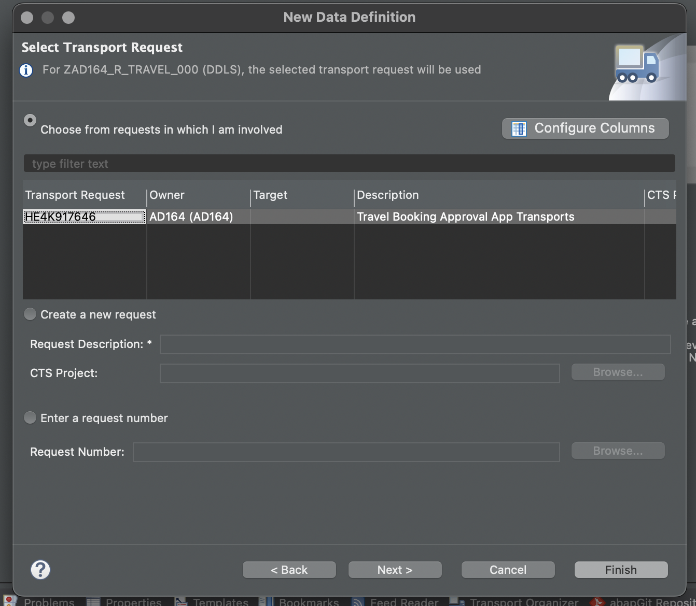
    
  4. Select **Define Root View Entity** from the list of templates and click on **Finish**
     

  5. A CDS entity with the following data definition should get generated
     
     
  6. Replace the default source code with following code snippet:
   
   **Hint**: Hover over the code snippet and choose the _Copy raw contents_ icon  appearing in the upper-right corner to copy it. Ensure to replace all occurences of XXX with your user group number
     
    ```ABAP
       @AccessControl.authorizationCheck: #NOT_REQUIRED
       @EndUserText.label: 'Data model for Travel App XXX'
       define root view entity zad164_r_travel_XXX 
         as select from zad164travel_000 as travel_XXX
         
         association [0..1] to zad164_r_agency             as _Agency         on $projection.AgencyId = _Agency.AgencyId
         association [0..1] to zad164_r_customer           as _Customer       on $projection.CustomerId = _Customer.CustomerID
         association [1..1] to zad164_r_overall_status_vh  as _OverallStatus  on $projection.OverallStatus = _OverallStatus.OverallStatus
         association [0..1] to I_Currency                  as _Currency       on $projection.CurrencyCode = _Currency.Currency
       {
         key travel_uuid as TravelUuid,
         travel_id             as TravelId,
         agency_id             as AgencyId,
         customer_id           as CustomerId,
         begin_date            as BeginDate,
         end_date              as EndDate,
         @Semantics.amount.currencyCode: 'CurrencyCode'
         booking_fee           as BookingFee,
         @Semantics.amount.currencyCode: 'CurrencyCode'
         total_price           as TotalPrice,
         currency_code         as CurrencyCode,
         description           as Description,
         overall_status        as OverallStatus,
         @Semantics.user.createdBy: true
         local_created_by      as LocalCreatedBy,
         @Semantics.systemDateTime.createdAt: true
         local_created_at      as LocalCreatedAt,
         @Semantics.user.lastChangedBy: true
         local_last_changed_by as LocalLastChangedBy,
         @Semantics.systemDateTime.localInstanceLastChangedAt: true
         local_last_changed_at as LocalLastChangedAt,
       
         @Semantics.systemDateTime.lastChangedAt: true
         last_changed_at       as LastChangedAt,
         
         /* Associations */
         _Agency,
         _Customer,
         _OverallStatus,
         _Currency
         
       }

     ```
     
   7.	Save and activate the object.
   8.	Define Access Control for the above CDS Root view - Right-click on the CDS root entity  **`ZAD164_R_TRAVEL_XXX`** and select **New Access Control** from the context menu.
      
   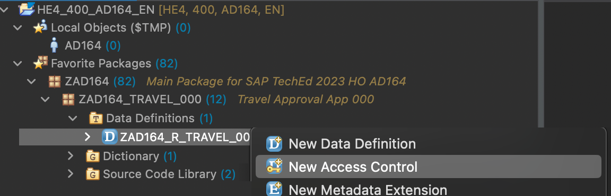
     	
   9. Maintain the information provided below and click **Next**.

   - Name: **`ZAD164_R_TRAVEL_XXX`**
   - Description: **`Access Control for ZAD164_R_TRAVEL_XXX`** .   
     

  10. Select your transport request and click **Finish**.
    

  11. An access control for the CDS entity with the following access control definition should get generated
     

  12. Replace the default source code with following code snippet:
   
   **Hint**: Hover the code snippet and choose the _Copy raw contents_ icon  appearing in the upper-right corner to copy it. Ensure to replace all occurences of XXX with your user group number

     
    ```ABAP
     @EndUserText.label: 'Access Control for ZAD164_R_TRAVEL_XXX'
     @MappingRole: true
     define role ZAD164_R_TRAVEL_XXX {
       grant
         select
           on
             zad164_r_travel_000
               where
                 1 = 1;
                 
     }
     
     ```
     
   13.	Save and activate the object.
      
 </details>
 
## Exercise 1.4 Create a CDS projection views
[^Top of page](#)

 <details>
  <summary>Click to expand!</summary>
  
  1.	Right-click on the CDS root entity  **`ZAD164_R_TRAVEL_XXX`** and select **New Data Definition** from the context menu.
    

  2. Maintain the information provided below and click **Next >**.

   - Name: **`ZAD164_C_TRAVEL_XXX`**
   - Description: **`Projection for Travel App XXX`** .   
    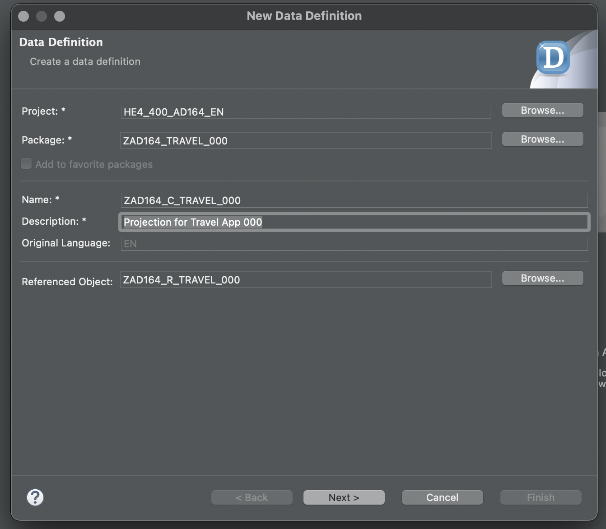
    
  3.Select your transport request and click **Next**.
    
    
  4. Select **Define Projection View** from the list of templates and click on **Finish**
    

  5. A CDS projection entity with the following data definition should get generated
    
     
  6. Replace the default source code with following code snippet:
   
   **Hint**: Hover the code snippet and choose the _Copy raw contents_ icon  appearing in the upper-right corner to copy it. Ensure to replace all occurences of XXX with your user group number

     
    ```ABAP
     @EndUserText.label: 'Travel Projection View'
     @AccessControl.authorizationCheck: #CHECK
     
     @Metadata.allowExtensions: true
     @Search.searchable: true
     @ObjectModel.semanticKey: ['TravelID']
     define root view entity zad164_c_travel_XXX 
       provider contract transactional_query
       as projection on zad164_r_travel_XXX
     {
       key TravelUuid,
           
           @Search.defaultSearchElement: true
           TravelId,
     
           @Search.defaultSearchElement: true
           @ObjectModel.text.element: ['AgencyName']
           AgencyId,
           _Agency.Name              as AgencyName,
     
     
           @Search.defaultSearchElement: true
           @ObjectModel.text.element: ['CustomerName']
           CustomerId,
           _Customer.LastName        as CustomerName,
     
           BeginDate,
           EndDate,
     
           BookingFee,
           TotalPrice,
           CurrencyCode,
     
           Description,
     
           @ObjectModel.text.element: ['OverallStatusText']
           OverallStatus,
           _OverallStatus._Text.Text as OverallStatusText : localized,
     
           LocalLastChangedAt,
     
           _Agency,
           _Currency,
           _Customer,
           _OverallStatus
     }

     ```
     
   7.	Save and activate the object.
   8.	Define Access Control for the above projection CDS Root view by right-click on the CDS root entity  **`ZAD164_C_TRAVEL_XXX`** and select **New Access Control** from the context menu.
    
   9. Maintain the information provided below and click **Next >**.

   - Name: **`ZAD164_C_TRAVEL_XXX`**
   - Description: **`Access Control for ZAD164_C_TRAVEL_XXX`** .   
    

  10. Select your transport request and click **Next**.
    

  11. An access control for the CDS projection entity with the following access control definition should get generated
     

  12. Replace the default source code with following code snippet:
   
   **Hint**: Hover the code snippet and choose the _Copy raw contents_ icon  appearing in the upper-right corner to copy it. Ensure to replace all occurences of XXX with your user group number

     
    ```ABAP
     @EndUserText.label: 'Access Control for ZAD164_C_TRAVEL_000'
     @MappingRole: true
     define role ZAD164_C_TRAVEL_000 {
       grant
         select
           on
             ZAD164_C_TRAVEL_000
               where
                 inheriting conditions from entity ZAD164_R_Travel_000;
     }
     
     ```
     
   13.	Save and activate the object.
   14.	Right-click on the CDS root entity  **`ZAD164_C_TRAVEL_XXX`** and select **New Metadata Extension** from the context menu.    
    

   15. Maintain the information provided below and click **Next >**.

       - Name: **`ZAD164_C_TRAVEL_XXX`**
       - Description: **`Metadata Extension for ZAD164_C_TRAVEL_XXX`** .   
    

   16. Select your transport request and click **Finish**.
    

   17. An metadata extension for the CDS projection entity with the following metadata definition should get generated
     

   18. Replace the default source code with following code snippet:
   
   **Hint**: Hover the code snippet and choose the _Copy raw contents_ icon  appearing in the upper-right corner to copy it. Ensure to replace all occurences of XXX with your user group number

     
    ```ABAP
     @Metadata.layer: #CORE

     @UI: { headerInfo: { typeName: 'Travel',
                          typeNamePlural: 'Travels',
                          title: { type: #STANDARD, value: 'TravelID' } },
            presentationVariant: [{ sortOrder: [{ by: 'BeginDate', direction: #DESC }
                                               ], 
                                    visualizations: [{type: #AS_LINEITEM}]  }] }
     
     annotate entity zad164_c_travel_XXX with
     {
       @UI.facet: [{ type: #IDENTIFICATION_REFERENCE }]
       @UI.hidden: true
       TravelUuid;
     
       @UI: { lineItem:       [{ position: 10 }],
              identification: [{ position: 10 }],
              selectionField: [{ position: 10 }]}
       TravelId;
     
       @UI: { lineItem:       [{ position: 20 }],
              identification: [{ position: 20 }],
              selectionField: [{ position: 20 }]}
       @Consumption.valueHelpDefinition: [{ entity : {name: 'zad164_r_agency_std_vh', element: 'AgencyID' }}]
       AgencyId;
     
       @UI: { lineItem:       [{ position: 40 }],
              identification: [{ position: 40 }],
              selectionField: [{ position: 40 }]}
       @Consumption.valueHelpDefinition: [{entity: {name: 'zad164_r_customer_stdvh', element: 'CustomerID' }}]
       CustomerId;
     
       @UI: { lineItem:       [{ position: 50 }],
              identification: [{ position: 50 }]}
       BeginDate;
     
       @UI: { lineItem:       [{ position: 60 }],
              identification: [{ position: 60 }]}
       EndDate;
     
       @UI: { lineItem:       [{ position: 70 }],
              identification: [{ position: 70 }]}
       BookingFee;
     
       @UI: { lineItem:       [{ position: 80 }],
              identification: [{ position: 80 }]}
       TotalPrice;
     
       @Consumption.valueHelpDefinition: [{entity: {name: 'I_CurrencyStdVH', element: 'Currency' }}]
       CurrencyCode;
     
       @UI: { lineItem:       [{ position: 90 }],
              identification: [{ position: 90 }]}
       Description;
     
       @UI: { lineItem:       [{ position: 100 },
                               { type: #FOR_ACTION, dataAction: 'acceptTravel', label: 'Accept Travel', position: 10 },
                               { type: #FOR_ACTION, dataAction: 'rejectTravel', label: 'Reject Travel', position: 20 }],
              identification: [{ position: 100 }],
              selectionField: [{ position: 100 }],
              textArrangement: #TEXT_ONLY }
       @Consumption.valueHelpDefinition: [{ entity: {name: 'zad164_r_overall_status_vh', element: 'OverallStatus' }}]
       OverallStatus;
     
       @UI.hidden: true
       OverallStatusText;
     
       @UI.hidden: true
       LocalLastChangedAt;
     
     }
     ```
     
   19.	Save and activate the object.
       
 </details>
 
## Exercise 1.5 Create Your Service Definition
[^Top of page](#)

 <details>
  <summary>Click to expand!</summary>
     
   1. Right click on projection view **`ZAD164_C_TRAVEL_XXX`** and select create **New Service Definition** from the context menu.
      
     
   2. Maintain the information provided below and click **Next >**
    - Name: **`ZAD164_SD_TRAVEL_XXX`**
    - Description: **Service Definition for Travel App XXX**
      
      

   4. Select your transport request and press **Finish**. 

      
   5. A service definition for the projection CDS entity with the following details should get generated
      

   6. Provide an alias name as `Travel` for the cds projection view that is being exposed. The service definition should now look like this
      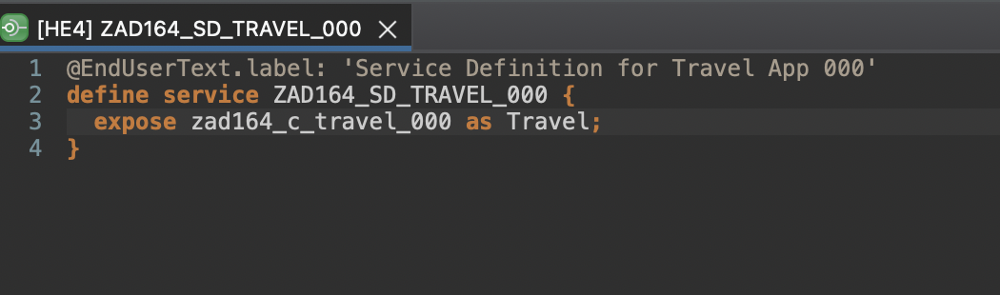

   7. Save and activate the object.
      
 </details>
 
## Exercise 1.6 Create Your Service Binding and Test using Fiori Elements Preview
[^Top of page](#)

 <details>
  <summary>Click to expand!</summary>
  1. Right-click on your service definition **`ZAD164_SD_TRAVEL_000`** and select **New Service Binding** from the context menu.
  
   

2. Maintain the information provided below and click **Next**. 
    - Name: **`ZAD164_UI_TRAVEL_000_O4`**
    - Description: _**`OData V4 UI service for Travel App 000`**_
    - Binding Type: **`OData version V4 UI`**

    

3. Select your transport request and press **Finish**.
    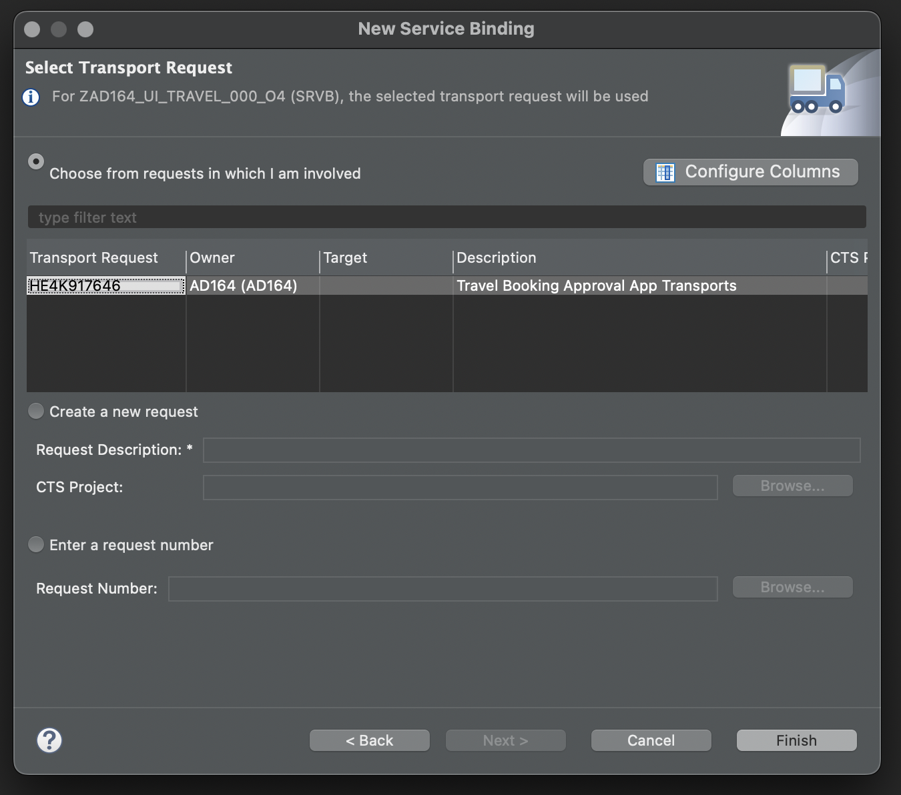
4. A service binding for the service definition is created and the created artefact looks like this
    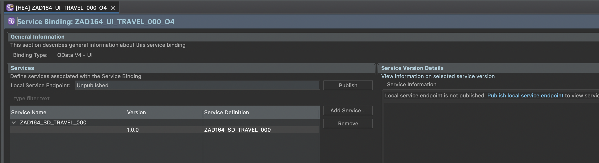
6. Activate and publish your service binding.
    

7. Click on **Fiori elements App Preview** to preview your application in the browser.
    
 </details>
 
## Exercise 1.7 Generate Test data and Test using Fiori Elements Preview
[^Top of page](#)

 <details>
  <summary>Click to expand!</summary>
  This exercise will fill the relevant table with travel booking data.
  Perform the following steps
  
  1. Right Click on package **`ZAD164_TRAVEL_XXX`** and select **New** -> **ABAP Class** from context men
 
   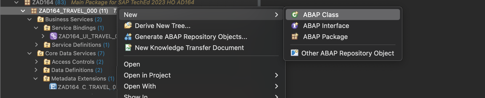
   
  2. Maintain the following details and click on **Next**
       Name : **ZAD164_CL_FL_TRVL_DT_GEN_XXX**
       Description: **Flight Travel Data Generator XXX*
  
   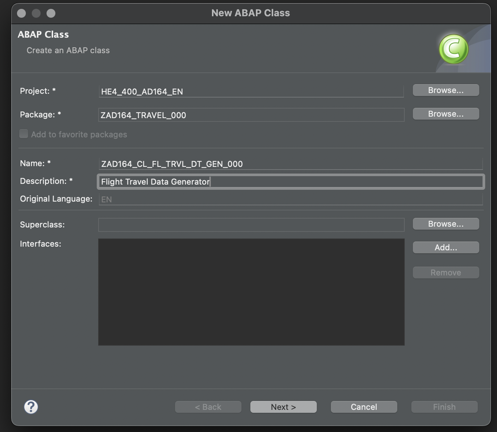
   
  3. Select your transport request and press **Finish**. 
    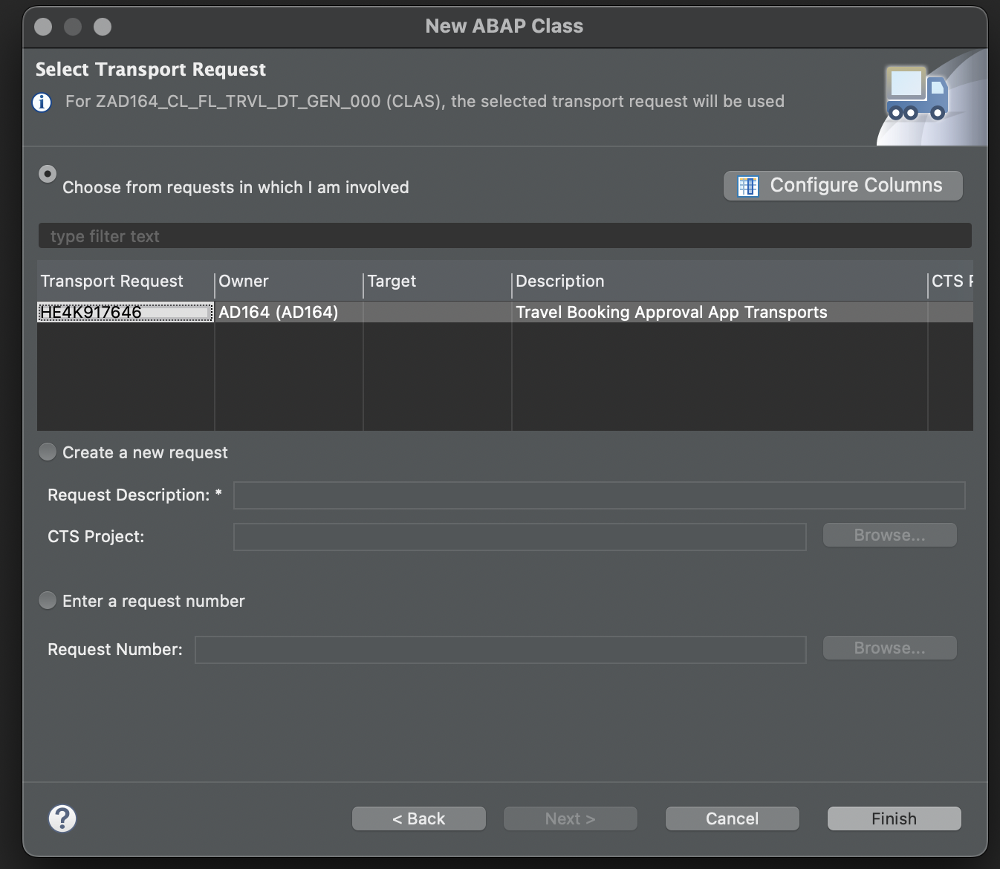
  4. Replace the generated code in the global class with the following code
     ```ABAP
       CLASS zad164_cl_fl_trvl_dt_gen_XXX DEFINITION
          PUBLIC
          FINAL
          CREATE PUBLIC .
        
          PUBLIC SECTION.
           INTERFACES: if_oo_adt_classrun.
          PROTECTED SECTION.
          PRIVATE SECTION.
       ENDCLASS.
       CLASS zad164_cl_fl_trvl_dt_gen_XXX IMPLEMENTATION.
         METHOD if_oo_adt_classrun~main.
       
           SELECT * FROM zad164travel INTO TABLE @DATA(travel_data).
           DELETE FROM zad164travel_XXX.
           INSERT zad164travel_xxx FROM TABLE @travel_data.
           out->write( 'Travel data generation completed' ) ##NO_TEXT.
         ENDMETHOD.
        ENDCLASS.
     ```
  6. Save and activate the object.
  7. Execute the class as an ABAP Console Application using the F9 key.
  8. Open the Service Binding **ZAD164_UI_TRAVEL_000_O4**
     Double click on the **Preview** button to test the fiori elements preview with the generated data
     
     
 </details>


## Summary

You now have a oData V4 UI service that is ready for consumption in a Read Only Fiori App. Building a suitable SAP Fiori app via SAP Business Application Studio and deploying to the system is outside the scope of this HandsOn exercise.

Continue to - [Exercise 2 - Enhance the Read Only UI service with Transactional Capabilities and showcase developer extensibility and Fiori feature](../ex2/README.md)

