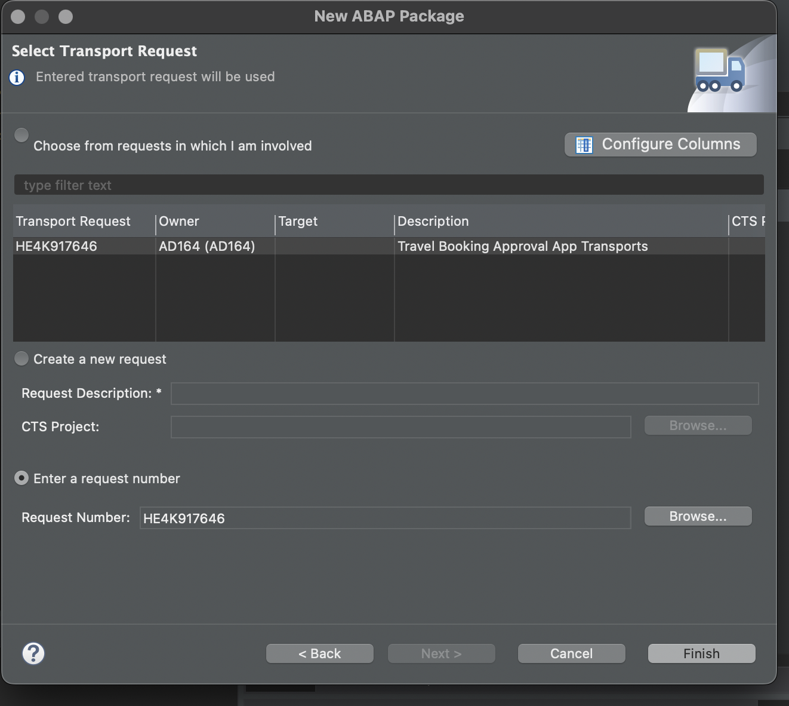

# Exercise 1 - Create Your Own Transaction UI Service

After the **[Getting Started](../ex0/README.md)**, you will create your own RAP business object (BO) in the present exercise.

This RAP BO represents an Travel Booking Approval application , where you can Approve OR Reject travel booking as a booking approver.

## Exercise 1.1 Create ABAP Package
[^Top of page](#)

 <details>
  <summary>Click to expand!</summary>
  
0.  Optional [ If already exists ]   : Add **ZLOCAL** to **Favorite Packages** by right-click on the favourite packages and select **Add Package..**. 
   
    In the pop up for **Select an ABAP Package**, type ZLOCAL as the search term and choose the option **ZLOCAL** under the **Matching items:** window and click on **OK**.
   
   
1.	Right-click on the package **`ZLOCAL** and select **New > ABAP Package** from the context menu. 
    
2.	Maintain the information provided below and click **Next >**.  
    - Name: **`ZAD164_TRAVEL_XXX`**
    - Description: `Travel Approval App XXX`
    - Check ** `Add to favorite packages` **
     
    - Select TR `HE4K917646` from option **Choose from requests in which i am involved** OR choose option **Enter a request number** and  provide a transport request number `HE4K917646`
     
      
 
3.	Click **Finish** to finish creation of the package and add the package to favorite pacakges list
      
  
</details>


## Exercise 1.2 Create Database Table

After completing these steps you will have...

1.	Enter this code.
```abap
DATA(lt_params) = request->get_form_fields(  ).
READ TABLE lt_params REFERENCE INTO DATA(lr_params) WITH KEY name = 'cmd'.
  IF sy-subrc <> 0.
    response->set_status( i_code = 400
                     i_reason = 'Bad request').
    RETURN.
  ENDIF.

```

## Exercise 1.3 Create CDS data model
## Exercise 1.4 Create CDS projection views
## Exercise 1.5 Create Behavior Defintion for CDS data model
## Exercise 1.6 Create Behavior Defintion for projection views
## Exercise 1.7 Create Your Service Definition
## Exercise 1.8 Create Your Service Binding and Test using Fiori Elements Preview

    
2.	Click here.
<br>


## Summary

You've now ...

Continue to - [Exercise 2 - Exercise 2 Description](../ex2/README.md)

