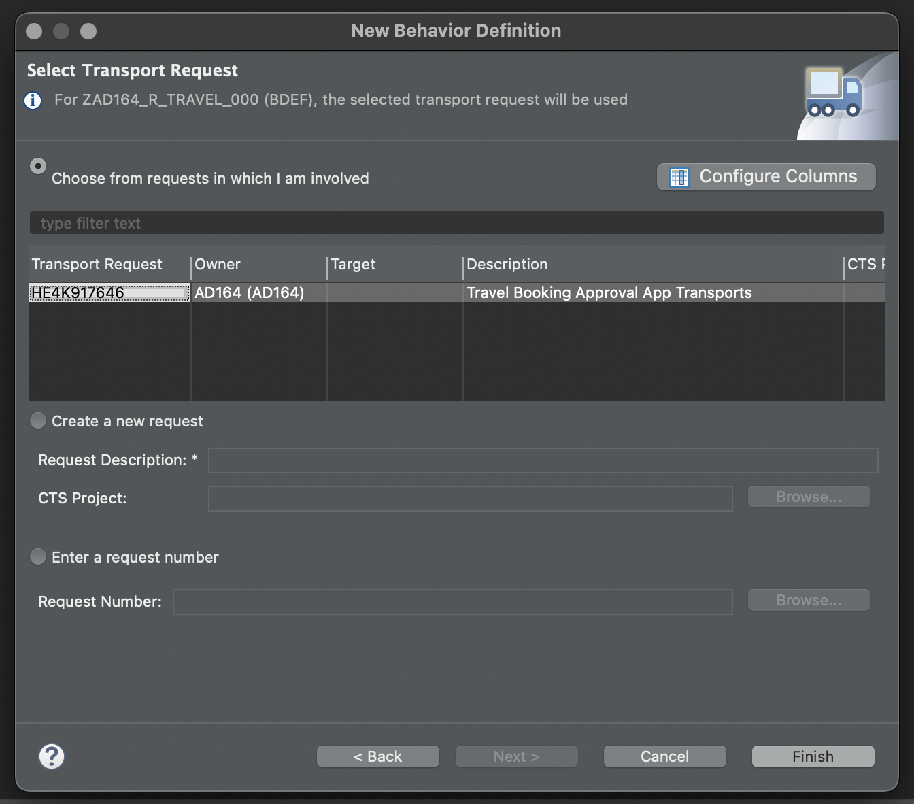

# Exercise 2 - Enhance the Read Only UI service with Transactional Capabilities and showcase developer extensibility and Fiori feature

In this exercise, we enrich our travel booking data model with transactional capabilities - Approve and Reject Custom Actions, agency ratings to provide a sneak preview of using a rating indicator to enrich the UI with additional information about the rating of the agency that has booked the travel for the customer..

## Exercise 2.1 Enable Read Only UI service with custom actions
After completing this exercise, you will have enabled the Travel booking approval app with **APPROVE** and **REJECT** custom actions.
1.	Open the behavior definition for view **ZAD164_R_TRAVEL_XXX** from the project explorer and add two custom actions APPROVE and REJECT.
   The behvior definition should look like this after defining the custom actions
  	<br>
  	```abap
    managed implementation in class zbp_ad164_r_travel_000 unique;
    strict ( 2 );
    
    define behavior for zad164_r_travel_000 alias zad164_travel_000
    persistent table zad164travel_000
    lock master
    authorization master ( global )
    etag master LocalLastChangedAt
    {
    //  create;
    //  update;
    //  delete;
    
      internal update;
    
      field ( readonly, numbering : managed ) TravelUUID;
    
      action acceptTravel result [1] $self;
      action rejectTravel result [1] $self;
    
      mapping for zad164travel_000
        {
          TravelUUID         = travel_uuid;
          TravelID           = travel_id;
          AgencyID           = agency_id;
          CustomerID         = customer_id;
          BeginDate          = begin_date;
          EndDate            = end_date;
          BookingFee         = booking_fee;
          TotalPrice         = total_price;
          CurrencyCode       = currency_code;
          Description        = description;
          OverallStatus      = overall_status;
          LastChangedAt      = last_changed_at;
          LocalCreatedAt     = local_created_at;
          LocalCreatedBy     = local_created_by;
          LocalLastChangedAt = local_last_changed_at;
          LocalLastChangedBy = local_last_changed_by;
        }
    } ```
    
2. Save and active the behavior definition
3.	Use the quick assist to generate the defintion for the actions defined in our behavior implementation class **ZBP_AD164_R_TRAVEL_XXX**
<br>
4. Local class include of the behaviour implementation class **ZBP_AD164_R_TRAVEL_XXX** should look like this
<br>
5. Save and activate the behavior implementation class.
6. Implement action ACCEPT, save and activate the behavior implementation class.
<br>
8. Implement action REJECT, save and activate the behavior implementation class.
<br>
10. Test the implementation of ACCEPT and REJECT actions from **Preview** functionality of the UI oData service of the service binding **ZAD164_UI_TRAVEL_XXX_O4**
    Note that the buttons ACCEPT and REJECT will be active once we select a data record and on clicking the buttons, resepctive status will be set against
  List should look like this before selecting a record
  <br>

  List should look like this after selecting a record
  <br>
  After clicking on the Approve action button, the record details should have the Overall Status set to Accepted
  <br>
 
## Exercise 2.2 Demo Only - How to add additional fields/ associations/compositions to existing data models via Developer Extensibility 

After completing this demo, we will have created a parent-child ( composition ) association between our Agency and Agency Review Rating entities and hence will be able to use this to calculate average rating for the agency. 
Showcase the following 
 - Current Agency CDS Entity : ZAD164_R_AGENCY
 - Extend View defintion on Agency Entity : ZAD164_R_AGENCY_EXTEND
 - View which is accessed as an extnesion : ZAD164_R_AGENCY_REVIEW

## Exercise 2.3 Consume the data from extended view

After completing these steps you will have included a new field for average rating in the travel booking data model which consumes the data from the entity that was added as part of developer extensibility demo.

1.	Open the data definition for view **ZAD164_R_TRAVEL_000** from the project explorer and add a new association to **ZAD164_R_AGENCY_REVIEW** and compute the average rating for the agency from the data from association.
   NOTE: While using the avg(... ) function, the CDS entity prompts to use GROUP BY clause in CDS entity -> Use the quick assist to generate the required data
The entity should now look like this
<br>
```abap
    @AccessControl.authorizationCheck: #NOT_REQUIRED
    @EndUserText.label: 'Data model for Travel App'
    define root view entity zad164_r_travel_000 
      as select from zad164travel_000 as travel_000
      
      association [0..1] to zad164_r_agency             as _Agency         on $projection.AgencyId = _Agency.AgencyId
      association [0..*] to zad164_r_agency_review      as _AgencyReview   on $projection.AgencyId = _AgencyReview.AgencyId
      association [0..1] to zad164_r_customer           as _Customer       on $projection.CustomerId = _Customer.CustomerID
      association [1..1] to zad164_r_overall_status_vh  as _OverallStatus  on $projection.OverallStatus = _OverallStatus.OverallStatus
      association [0..1] to I_Currency                  as _Currency       on $projection.CurrencyCode = _Currency.Currency
    {
      key travel_uuid                           as TravelUuid,
      travel_id                                 as TravelId,
      agency_id                                 as AgencyId,
      avg( _AgencyReview.Rating as abap.fltp )  as AgencyRating,
      customer_id                               as CustomerId,
      begin_date                                as BeginDate,
      end_date                                  as EndDate,
      @Semantics.amount.currencyCode: 'CurrencyCode'
      booking_fee                               as BookingFee,
      @Semantics.amount.currencyCode: 'CurrencyCode'
      total_price                               as TotalPrice,
      currency_code                             as CurrencyCode,
      description                               as Description,
      overall_status                            as OverallStatus,
      @Semantics.user.createdBy: true
      local_created_by                          as LocalCreatedBy,
      @Semantics.systemDateTime.createdAt: true
      local_created_at                          as LocalCreatedAt,
      @Semantics.user.lastChangedBy: true
      local_last_changed_by                     as LocalLastChangedBy,
      @Semantics.systemDateTime.localInstanceLastChangedAt: true
      local_last_changed_at                     as LocalLastChangedAt,
    
      @Semantics.systemDateTime.lastChangedAt: true
      last_changed_at                           as LastChangedAt,
      
      /* Associations */
      _Agency,
      _AgencyReview,
      _Customer,
      _OverallStatus,
      _Currency
      
    }
    group by
      travel_uuid,
      travel_id,
      agency_id,
      customer_id,
      begin_date,
      end_date,
      booking_fee,
      total_price,
      currency_code,
      description,
      overall_status,
      local_created_by,
      local_created_at,
      local_last_changed_by,
      local_last_changed_at,
      last_changed_at
```

2.	Click here.
<br>

## Summary

You've now ...

Continue to - [Exercise 3 - Excercise 3 ](../ex3/README.md)
