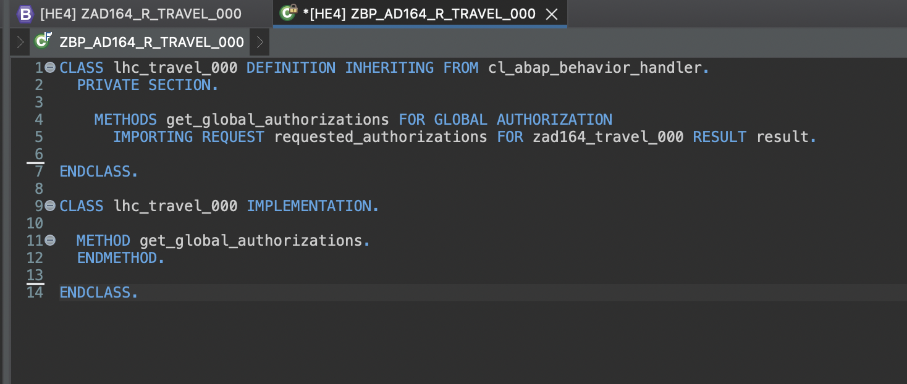
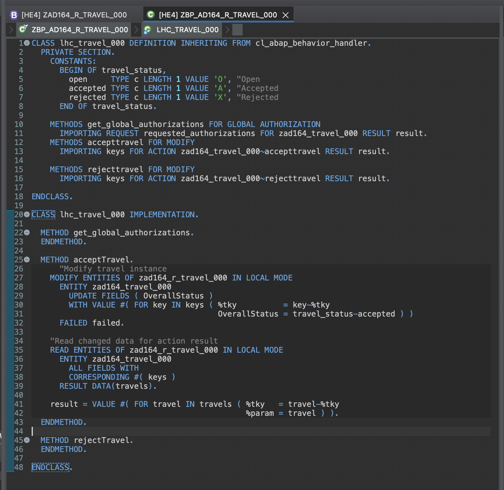

# Exercise 2 - Enhance the Read Only UI service with Transactional Capabilities and showcase developer extensibility and Fiori feature

In this exercise, we enrich our travel booking data model with transactional capabilities - Approve and Reject Custom Actions, agency ratings to provide a sneak preview of using a rating indicator to enrich the UI with additional information about the rating of the agency that has booked the travel for the customer..

## Exercise 2.1 Create Behavior Definition for CDS data model
[^Top of page](#)

 

 
Click to expand!

  
1.	Right-click your data definition **`ZAD164_R_TRAVEL_XXX`** and select **New Behavior Definition** from the context menu.
   
 
2.	Maintain a description and click **`Next`**.
   - Description: _**`Behavior for Travel App XXX`**_
   - Retain **Implementation Type:** as **`Managed`**
  
 
3.	Select your transport request and click **`Finish`**.
   
  	
4.	A behavior definition for the CDS  entity with the following details should get generated
   
 
5.	Replace the default source code with following code snippet:

      <pre lang="ABAP">
       managed implementation in class zbp_ad164_r_travel_XXX unique;
       strict ( 2 );
       
       define behavior for zad164_r_travel_XXX alias zad164_travel_XXX
       persistent table zad164travel_XXX
       lock master
       authorization master ( instance )
       etag master LocalLastChangedAt
       {
       //  create;
       //  update;
       //  delete;
         internal update;
       
         field ( readonly, numbering : managed ) TravelUUID;
       
         mapping for zad164travel_XXX
           {
             TravelUUID         = travel_uuid;
             TravelID           = travel_id;
             AgencyID           = agency_id;
             CustomerID         = customer_id;
             BeginDate          = begin_date;
             EndDate            = end_date;
             BookingFee         = booking_fee;
             TotalPrice         = total_price;
             CurrencyCode       = currency_code;
             Description        = description;
             OverallStatus      = overall_status;
             LastChangedAt      = last_changed_at;
             LocalCreatedAt     = local_created_at;
             LocalCreatedBy     = local_created_by;
             LocalLastChangedAt = local_last_changed_at;
             LocalLastChangedBy = local_last_changed_by;
           }
       }
       </pre>

6.	Save and activate the object.
7.	Bring up the Quick Assist proposals ( **`Ctrl + Shift + 1`** ) while hovering over the suggested implementation class name and select the proposal **`Create behavior implementation class zbp..`** to auto generate the behavior implementation class.
   
8.	Maintain a description and click **`Next`**.
   - Description: _**`Behavior implementation for ZAD164_R_TRAVEL_XXX`**_
   

9.	Select your transport request and click **`Finish`**.
   
    
10.	A behavior implementation class for the behavior definition with the following details should get generated
    

11.	Save and activate the object.
   
 

 
## Exercise 2.2 Create Behavior Definition for projection view
[^Top of page](#)

 

  
Click to expand!

1.	Right-click your projection view **`ZAD164_C_TRAVEL_XXX`** and select **New Behavior Definition** from the context menu.
  	
  
2.	Maintain a description and click **`Next`**.
   - Description: _**`Projection Behavior implementation for ZAD164_C_TRAVEL_XXX`**_
   
 
3.	Select your transport request and click **`Finish`**.
   

4.	A projection behavior definition for the projection CDS entity with the following details should get generated
  	
 
5.	Replace the default source code with following with code snippet:

    <pre lang="ABAP">
     projection;
     strict ( 2 );
     
     define behavior for zad164_c_travel_XXX alias zad164_travel_XXX
     {
     
       use action acceptTravel;
       use action rejectTravel;
     }
     </pre>
 
6.	Save and activate the object.

 

## Exercise 2.3 Enable the UI service with custom actions
[^Top of page](#)

 

  
Click to expand!

  
After completing this exercise, you will have enabled the Travel booking approval app with **APPROVE** and **REJECT** custom actions.
1.	Open the behavior definition for view **`ZAD164_R_TRAVEL_XXX`** from the project explorer and add two custom actions APPROVE and REJECT.
   	The behavior definition should look like this after defining the custom actions
  	 
  	
  <pre lang="ABAP">
    managed implementation in class zbp_ad164_r_travel_XXX unique;
    strict ( 2 );
    
    define behavior for zad164_r_travel_XXX alias zad164_travel_XXX
    persistent table zad164travel_XXX
    lock master
    authorization master ( global )
    etag master LocalLastChangedAt
    {
    //  create;
    //  update;
    //  delete;
    
      internal update;
    
      field ( readonly, numbering : managed ) TravelUUID;
    
      action acceptTravel result [1] $self;
      action rejectTravel result [1] $self;
    
      mapping for zad164travel_XXX
        {
          TravelUUID         = travel_uuid;
          TravelID           = travel_id;
          AgencyID           = agency_id;
          CustomerID         = customer_id;
          BeginDate          = begin_date;
          EndDate            = end_date;
          BookingFee         = booking_fee;
          TotalPrice         = total_price;
          CurrencyCode       = currency_code;
          Description        = description;
          OverallStatus      = overall_status;
          LastChangedAt      = last_changed_at;
          LocalCreatedAt     = local_created_at;
          LocalCreatedBy     = local_created_by;
          LocalLastChangedAt = local_last_changed_at;
          LocalLastChangedBy = local_last_changed_by;
        }
    } 
</pre>
    
2.	Save and active the behavior definition
3.	Use the quick assist to generate the definition for the actions defined in our behavior implementation class **`ZBP_AD164_R_TRAVEL_XXX`**
    

4.	Local class include of the behaviour implementation class **`ZBP_AD164_R_TRAVEL_XXX`** should look like this
    

5.	Save and activate the behavior implementation class.
6.	Implement action ACCEPT, save and activate the behavior implementation class.
   
<pre lang="ABAP">
   "Modify travel instance
    MODIFY ENTITIES OF zad164_r_travel_XXX IN LOCAL MODE
      ENTITY zad164_travel_XXX
        UPDATE FIELDS ( OverallStatus )
        WITH VALUE #( FOR key IN keys ( %tky          = key-%tky
                                        OverallStatus = travel_status-accepted ) )
      FAILED failed.

    "Read changed data for action result
    READ ENTITIES OF zad164_r_travel_XXX IN LOCAL MODE
      ENTITY zad164_travel_XXX
        ALL FIELDS WITH
        CORRESPONDING #( keys )
      RESULT DATA(travels).

    result = VALUE #( FOR travel IN travels ( %tky   = travel-%tky
                                              %param = travel ) ).
</pre>

    

7.	Implement action REJECT, save and activate the behavior implementation class.
   
<pre lang="ABAP">
   "Modify travel instance
    MODIFY ENTITIES OF zad164_r_travel_XXX IN LOCAL MODE
      ENTITY zad164_travel_XXX
        UPDATE FIELDS ( OverallStatus )
        WITH VALUE #( FOR key IN keys ( %tky          = key-%tky
                                        OverallStatus = travel_status-rejected ) )
      FAILED failed.

    "Read changed data for action result
    READ ENTITIES OF zad164_r_travel_XXX IN LOCAL MODE
      ENTITY zad164_travel_XXX
        ALL FIELDS WITH
        CORRESPONDING #( keys )
      RESULT DATA(travels).

    result = VALUE #( FOR travel IN travels ( %tky   = travel-%tky
                                              %param = travel ) ).
</pre>

    

8.	Test the implementation of ACCEPT and REJECT actions from **Preview** functionality of the UI oData service of the service binding **ZAD164_UI_TRAVEL_XXX_O4**

 Note that the buttons ACCEPT and REJECT will be active once we select a data record and on clicking the buttons, respective status will be set against
  	List should look like this before selecting a record
  	 

 List should look like this after selecting a record
    

 After clicking on the Approve action button, the record details should have the Overall Status set to Accepted
    
  

 
## Exercise 2.4 Demo Only - Add additional fields/ associations/compositions to existing data models via Developer Extensibility 
[^Top of page](#)

 

  
Click to expand!

After completing this demo, we will have created a parent-child ( composition ) association between our Agency and Agency Review Rating entities and hence will be able to use this to calculate average rating for the agency. 
Showcase the following
 - Current Agency CDS Entity : **`ZAD164_R_AGENCY`**
 - Extend View definition on Agency Entity : **`ZAD164_R_AGENCY_EXTEND`**
 - View which is accessed as an extension : **`ZAD164_R_AGENCY_REVIEW`**
  
 

 
## Exercise 2.5 Consume data from extended view and Test using Fiori Elements Preview
[^Top of page](#)

 

  
Click to expand!

After completing these steps you will have included a new field for average rating in the travel booking data model which consumes the data from the entity that was added as part of developer extensibility demo.

1.	Open the data definition for view **`ZAD164_R_TRAVEL_XXX`** from the project explorer and add a new association to **`ZAD164_R_AGENCY_REVIEW`** and compute the average rating for the agency from the data from association.

  	NOTE: While using the avg(... ) function, the CDS entity prompts to use **GROUP BY** clause in CDS entity -> Use the quick assist to generate the required data
The entity should now look like this
     

<pre lang="ABAP">
    @AccessControl.authorizationCheck: #NOT_REQUIRED
    @EndUserText.label: 'Data model for Travel App'
    define root view entity zad164_r_travel_XXX 
      as select from zad164travel_XXX as travel_XXX
      
      association [0..1] to zad164_r_agency             as _Agency         on $projection.AgencyId = _Agency.AgencyId
      association [0..*] to zad164_r_agency_review      as _AgencyReview   on $projection.AgencyId = _AgencyReview.AgencyId
      association [0..1] to zad164_r_customer           as _Customer       on $projection.CustomerId = _Customer.CustomerID
      association [1..1] to zad164_r_overall_status_vh  as _OverallStatus  on $projection.OverallStatus = _OverallStatus.OverallStatus
      association [0..1] to I_Currency                  as _Currency       on $projection.CurrencyCode = _Currency.Currency
    {
      key travel_uuid                           as TravelUuid,
      travel_id                                 as TravelId,
      agency_id                                 as AgencyId,
      avg( _AgencyReview.Rating as abap.fltp )  as AgencyRating,
      customer_id                               as CustomerId,
      begin_date                                as BeginDate,
      end_date                                  as EndDate,
      @Semantics.amount.currencyCode: 'CurrencyCode'
      booking_fee                               as BookingFee,
      @Semantics.amount.currencyCode: 'CurrencyCode'
      total_price                               as TotalPrice,
      currency_code                             as CurrencyCode,
      description                               as Description,
      overall_status                            as OverallStatus,
      @Semantics.user.createdBy: true
      local_created_by                          as LocalCreatedBy,
      @Semantics.systemDateTime.createdAt: true
      local_created_at                          as LocalCreatedAt,
      @Semantics.user.lastChangedBy: true
      local_last_changed_by                     as LocalLastChangedBy,
      @Semantics.systemDateTime.localInstanceLastChangedAt: true
      local_last_changed_at                     as LocalLastChangedAt,
    
      @Semantics.systemDateTime.lastChangedAt: true
      last_changed_at                           as LastChangedAt,
      
      /* Associations */
      _Agency,
      _AgencyReview,
      _Customer,
      _OverallStatus,
      _Currency
      
    }
    group by
      travel_uuid,
      travel_id,
      agency_id,
      customer_id,
      begin_date,
      end_date,
      booking_fee,
      total_price,
      currency_code,
      description,
      overall_status,
      local_created_by,
      local_created_at,
      local_last_changed_by,
      local_last_changed_at,
      last_changed_at
      </pre>

2.	Save and activate the CDS entity
3.	Open the data definition for the consumption view **`ZAD164_C_TRAVEL_XXX`** from the project explorer and add the computed average rating for the agency from the data from the CDS entity **`ZAD164_R_TRAVEL_XXX`**.

The entity should now look like this
     

<pre lang="ABAP">
      @EndUserText.label: 'Travel Projection View'
      @AccessControl.authorizationCheck: #CHECK
      
      @Metadata.allowExtensions: true
      @Search.searchable: true
      define root view entity zad164_c_travel_XXC 
        provider contract transactional_query
        as projection on zad164_r_travel_XXX
      {
        key TravelUuid,
            
            @Search.defaultSearchElement: true
            TravelId,
      
            @Search.defaultSearchElement: true
            @ObjectModel.text.element: ['AgencyName']
            AgencyId,
            _Agency.Name              as AgencyName,
            AgencyRating,
      
            @Search.defaultSearchElement: true
            @ObjectModel.text.element: ['CustomerName']
            CustomerId,
            _Customer.LastName        as CustomerName,
      
            BeginDate,
            EndDate,
      
            BookingFee,
            TotalPrice,
            CurrencyCode,
      
            Description,
      
            @ObjectModel.text.element: ['OverallStatusText']
            OverallStatus,
            _OverallStatus._Text.Text as OverallStatusText : localized,
      
            LocalLastChangedAt,
      
            _Agency,
            _AgencyReview,
            _Currency,
            _Customer,
            _OverallStatus
      }   
</pre>

4.	Save and activate the CDS entity
5.	Open the meta data definition for the consumption view **`ZAD164_C_TRAVEL_XXX`** from the project explorer and add the UI annotations for the Agency Rating.
 
   The entity should now look like this
    

<pre lang="ABAP">
      @Metadata.layer: #CORE

      @UI: { headerInfo: { typeName: 'Travel',
                           typeNamePlural: 'Travels',
                           title: { type: #STANDARD, value: 'TravelID' } },
             presentationVariant: [{ sortOrder: [{ by: 'BeginDate', direction: #DESC }
                                                ], 
                                     visualizations: [{type: #AS_LINEITEM}]  }] }
      
      annotate entity zad164_c_travel_000 with
      {
        @UI.facet: [{ type: #IDENTIFICATION_REFERENCE }]
        @UI.hidden: true
        TravelUuid;
      
        @UI: { lineItem:       [{ position: 10 }],
               identification: [{ position: 10 }],
               selectionField: [{ position: 10 }]}
        TravelId;
      
        @UI: { lineItem:       [{ position: 20 }],
               identification: [{ position: 20 }],
               selectionField: [{ position: 20 }]}
        @Consumption.valueHelpDefinition: [{ entity : {name: 'zad164_r_agency_std_vh', element: 'AgencyId' }}]
        AgencyId;
        
        @UI: { 
        dataPoint: {
          qualifier: 'AgencyRating',
          targetValue: 5,
          visualization: #RATING,
          title: 'Agency Rating Indicator'
        },
        lineItem: [
          {
            type: #AS_DATAPOINT,
            label: 'Agency Rating Indicator',
            importance: #HIGH,
            position: 30
          }
        ],
        identification: [{ type: #AS_DATAPOINT,
                           label : 'Agency Rating Indicator',
                           importance: #HIGH,
                           position: 30 }]
        }
        AgencyRating;
      
        @UI: { lineItem:       [{ position: 40 }],
               identification: [{ position: 40 }],
               selectionField: [{ position: 40 }]}
        @Consumption.valueHelpDefinition: [{entity: {name: 'zad164_r_customer_stdvh', element: 'CustomerID' }}]
        CustomerId;
      
        @UI: { lineItem:       [{ position: 50 }],
               identification: [{ position: 50 }]}
        BeginDate;
      
        @UI: { lineItem:       [{ position: 60 }],
               identification: [{ position: 60 }]}
        EndDate;
      
        @UI: { lineItem:       [{ position: 70 }],
               identification: [{ position: 70 }]}
        BookingFee;
      
        @UI: { lineItem:       [{ position: 80 }],
               identification: [{ position: 80 }]}
        TotalPrice;
      
        @Consumption.valueHelpDefinition: [{entity: {name: 'I_CurrencyStdVH', element: 'Currency' }}]
        CurrencyCode;
      
        @UI: { lineItem:       [{ position: 90 }],
               identification: [{ position: 90 }]}
        Description;
      
        @UI: { lineItem:       [{ position: 100 },
                                { type: #FOR_ACTION, dataAction: 'acceptTravel', label: 'Accept Travel', position: 10 },
                                { type: #FOR_ACTION, dataAction: 'rejectTravel', label: 'Reject Travel', position: 20 }],
               identification: [{ position: 100 }],
               selectionField: [{ position: 100 }],
               textArrangement: #TEXT_ONLY }
        @Consumption.valueHelpDefinition: [{ entity: {name: 'zad164_r_overall_status_vh', element: 'OverallStatus' }}]
        OverallStatus;
      
        @UI.hidden: true
        OverallStatusText;
      
        @UI.hidden: true
        LocalLastChangedAt;
      
      }
</pre>

6.	Save and activate the metadata extension of the projection CDS entity
7.	Test the implementation of rating indicator from **Preview** functionality of the UI oData service of the service binding **`ZAD164_UI_TRAVEL_XXX_O4`**
    	Note that the Agency Review will be available as a Rating indicator on the list view as shown below
 
  	 

8.	To understand other controls that can be used in the fiori app, go through the [Fiori Feature Showcase App Guide](https://github.com/SAP-samples/abap-platform-fiori-feature-showcase/wiki/Feature-Showcase-App-Guide).

## Summary
[^Top of page](#)

 

  
Click to expand!

You've now enriched our travel booking data model with transactional capabilities - Approve and Reject Custom Actions, use developer extensibility to add agency ratings to the data model and also provide a sneak preview of using a rating indicator to enrich the UI with additional information about the rating of the agency that has booked the travel for the customer..
 

Continue to - [Additional Demos - RAP Behavior implementations, Usage of ABAP Repository Object Generator, Consumption of WRICEF objects in ABAP Cloud](../../README.md#addtional-demos)

